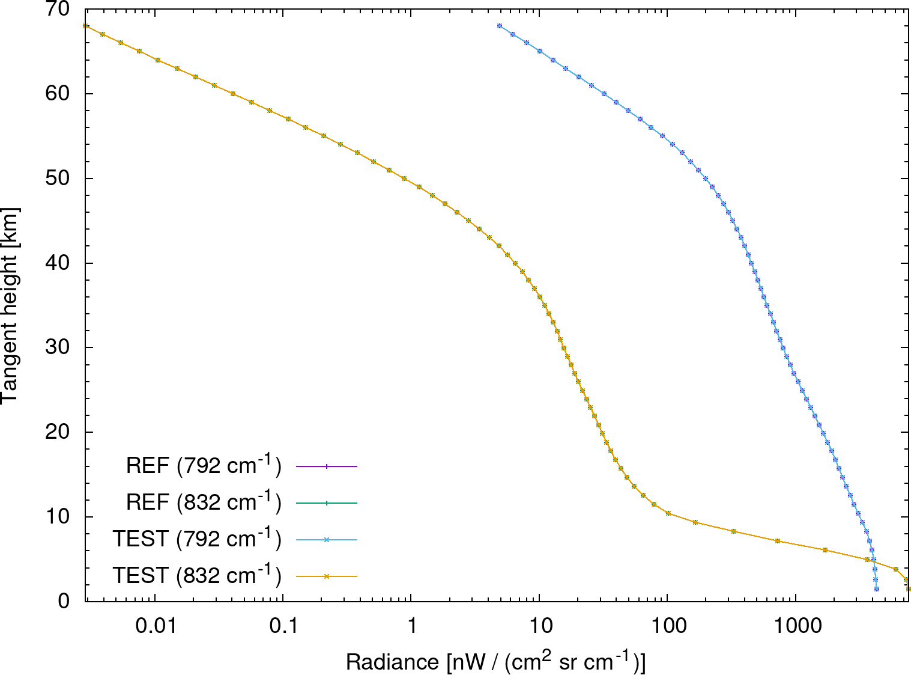
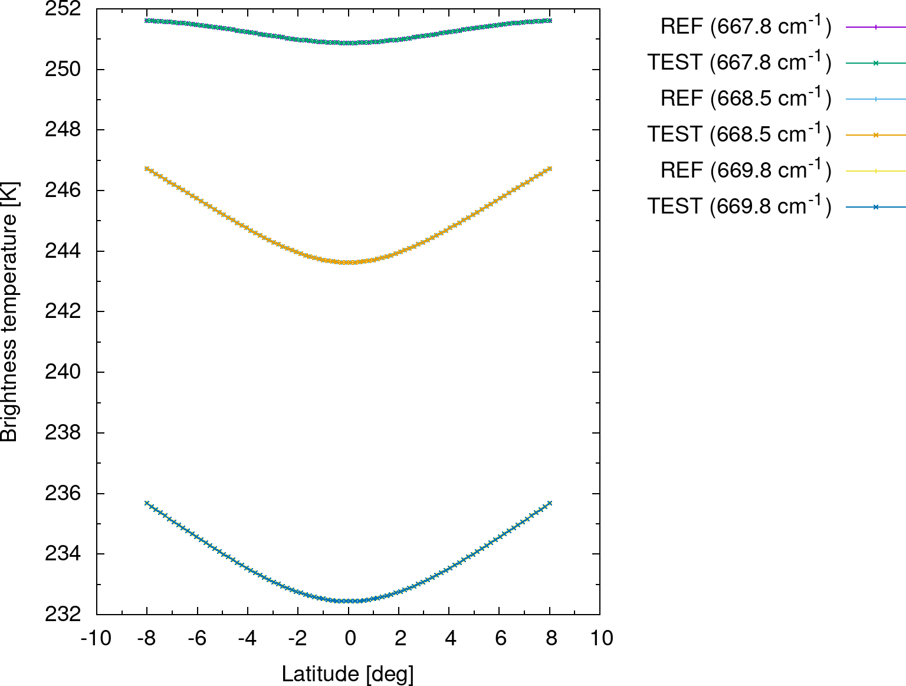

# Juelich Rapid Spectral Simulation Code

The Juelich Rapid Spectral Simulation Code (JURASSIC) is a fast infrared radiative transfer model for the analysis of atmospheric remote sensing measurements.

## Features

* JURASSIC uses the emissivity growth approximation (EGA) to conduct the radiative transfer calculations.
* Band transmittances are obtained from pre-calculated look-up tables from line-by-line calculations.
* The model was carefully tested in intercomparisons with the Karlsruhe Optimized and Precise Radiative Transfer Algorithm (KOPRA), the Reference Forward Model (RFM), and the Stand-alone AIRS Radiative Transfer Algorithm (SARTA).
* JURASSIC features an MPI/OpenMP hybrid parallelization for efficient use on supercomputers.

## Getting started

### Prerequisites

This documentation describes the installation of JURASSIC on a Linux system. A number of standard tools (gcc, git, make) and software libraries are needed to install JURASSIC. The [GNU Scientific Library](https://www.gnu.org/software/gsl) is required for numerical calculations. A copy of this library can be found in the git repository.

Start by downloading the source code from the git repository:

    git clone https://github.com/slcs-jsc/jurassic.git

To update an existing installation use:

    git pull https://github.com/slcs-jsc/jurassic.git

### Installation

First, compile the GSL library needed for JURASSIC by using the build script:

    cd jurassic/lib
    ./build.sh

Next, change to the source directory, edit the Makefile according to your needs, and try to compile the code:

    cd jurassic/src
    emacs Makefile
    make

The binaries will be linked statically, i.e., they can be copied and run on other machines. Sometimes this causes problems. In this case remove the '-static' flag from the CFLAGS in the Makefile and compile again.

By default we use rather strict compiler warnings. All warning messages will be turned into errors and no binaries will be produced. This behavior is enforced by the flag '-Werror'.

The binaries will remain in the jurassic/src/ directory.

### Run the examples

It is recommended that you create a project directory for testing the examples and also to store other experiments:

    mkdir -p jurassic/projects

This shows how to run the example for the nadir sounder:

    cp -a jurassic/example jurassic/projects
    cd jurassic/projects/example/nadir
    ./run.sh

This shows how to run the example for the limb sounder:

    cd ../limb
    ./run.sh

In both examples, we generate an observation geometry file,

    cat obs.tab

a standard atmosphere for mid-latitudes,

    cat atm.tab

and conduct radiative transfer calculations for two or three detector channels:

    cat rad.tab

The output of the simulation is verified by comparing it to reference data.
Additionally, gnuplot is used to create plots of the radiance data:

## Further information

More detailed information for new users and developers of JURASSIC is collected in the [GitHub wiki](https://github.com/slcs-jsc/jurassic/wiki).

These are the main references for citing the JURASSIC model in scientific publications:

* Baumeister, P. F. and Hoffmann, L.: Fast infrared radiative transfer calculations using graphics processing units: JURASSIC-GPU v2.0, Geosci. Model Dev., 15, 1855–1874, https://doi.org/10.5194/gmd-15-1855-2022, 2022.

* Hoffmann, L., and M. J. Alexander, Retrieval of stratospheric temperatures from Atmospheric Infrared Sounder radiance measurements for gravity wave studies, J. Geophys. Res., 114, D07105, https://doi.org/10.1029/2008JD011241, 2009.

* Hoffmann, L., Kaufmann, M., Spang, R., Müller, R., Remedios, J. J., Moore, D. P., Volk, C. M., von Clarmann, T., and Riese, M.: Envisat MIPAS measurements of CFC-11: retrieval, validation, and climatology, Atmos. Chem. Phys., 8, 3671-3688, https://doi.org/10.5194/acp-8-3671-2008, 2008.

* You can cite the source code of JURASSIC by using the DOI https://doi.org/10.5281/zenodo.4572889. This DOI represents all versions, and will always resolve to the latest one. Specific DOIs for each release of JURASSIC can be found on the zenodo web site.

Please see the [citation file](https://github.com/slcs-jsc/jurassic/blob/master/CITATION.cff) for further information.

## Contributing

We are interested in sharing JURASSIC for operational or research applications. Please do not hesitate to contact us, if you have any further questions or need support.

## License

JURASSIC is distributed under the [GNU General Public License v3.0](https://github.com/slcs-jsc/jurassic/blob/master/COPYING).

## Contact

Dr. Lars Hoffmann

Jülich Supercomputing Centre, Forschungszentrum Jülich

e-mail: l.hoffmann@fz-juelich.de

website: https://www.fz-juelich.de/ias/jsc/slcs
