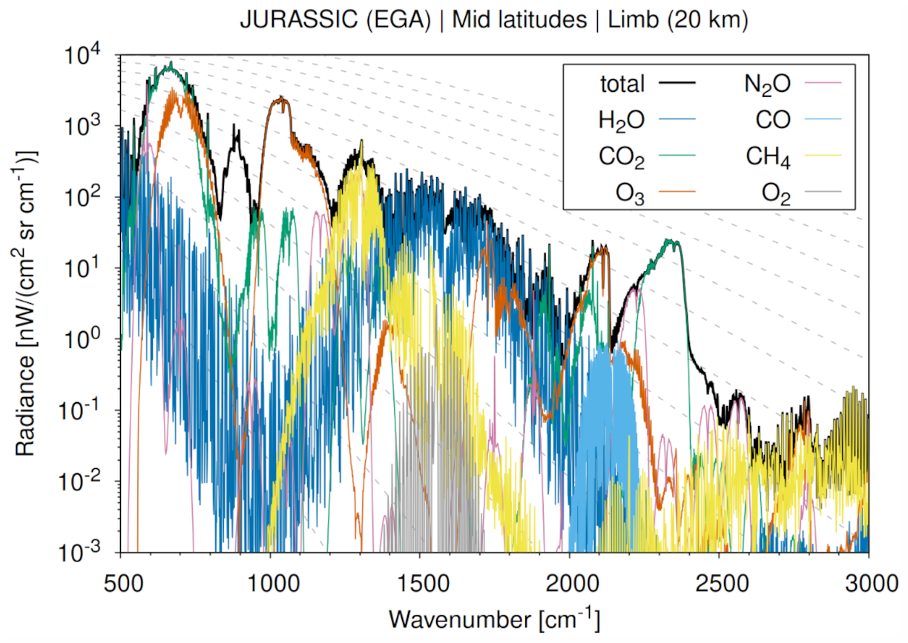

# Welcome to JURASSIC!

The Juelich Rapid Spectral Simulation Code (JURASSIC) is a fast
infrared radiative transfer model for the analysis of atmospheric
remote sensing measurements.

Designed specifically for atmospheric scientists and remote-sensing
experts, JURASSIC delivers fast, accurate, and scalable infrared
radiative transfer simulations. It is particularly well suited for
large data volumes and high-performance computing (HPC) environments,
enabling efficient processing without compromising physical accuracy.

JURASSIC supports the simulation and interpretation of infrared
spectra across a wide range of atmospheric conditions, making it a
powerful tool for both research and operational applications.

## Features

JURASSIC provides a comprehensive and efficient framework for infrared
radiative transfer simulations, offering key capabilities to support
research, operational, and development workflows:

- **Efficient radiative transfer approximations**: JURASSIC implements
    the Emissivity Growth Approximation (EGA) and the Curtis–Godson
    Approximation (CGA) to model infrared radiative transfer. These
    methods enable rapid yet accurate simulations of atmospheric
    radiances and transmittances across a broad spectral range.

- **High-fidelity spectroscopy via lookup tables**: Band
    transmittances are derived from pre-calculated lookup tables based
    on detailed line-by-line spectroscopy. This approach maintains
    spectroscopic accuracy while largely reducing computational cost,
    making the model suitable for large-scale and near-real-time
    applications.

- **Optimal estimation retrieval framework**: In addition to forward
    modelling, JURASSIC includes an optimal estimation retrieval
    module for inverse modelling of atmospheric state variables. This
    enables the derivation of geophysical parameters such as
    temperature or trace gas volume mixing ratios from observed
    radiances, providing a complete forward–inverse modelling system
    within the same framework.

- **Flexible configuration and modular design**: The model supports
    customizable spectral bands, instrument configurations, and
    atmospheric input fields, allowing users to integrate JURASSIC
    into diverse workflows and existing analysis pipelines.

- **Validated against established reference models**: The model has
    undergone extensive benchmarking and intercomparison studies with
    leading radiative transfer codes such as KOPRA, RFM, and SARTA,
    ensuring reliable performance and scientific credibility across a
    wide range of atmospheric conditions.

- **Hybrid parallelization for HPC environments**: JURASSIC enables
    hybrid MPI–OpenMP parallelization for highly efficient execution
    on multicore CPUs and HPC clusters, enabling the processing of
    large datasets, global simulations, or long time series with
    excellent scalability.

- **Open source and community oriented**: JURASSIC is distributed
    under the GNU General Public License (GPL), fostering
    transparency, collaboration, and community-driven development
    within the atmospheric and remote sensing research community.

## Getting started

If you are new to JURASSIC, start with the
[Quickstart](quickstart.md), which walks you through installation,
basic configuration, and a first simulation.

## Citation

If you use JURASSIC in your research, please cite the relevant
publications listed in the [References](references.md).

## Contact

We are interested in sharing JURASSIC for research
applications. Please do not hesitate to contact us, if you have any
questions or need support.

Dr. Lars Hoffmann, <l.hoffmann@fz-juelich.de>

Jülich Supercomputing Centre, Forschungszentrum Jülich
