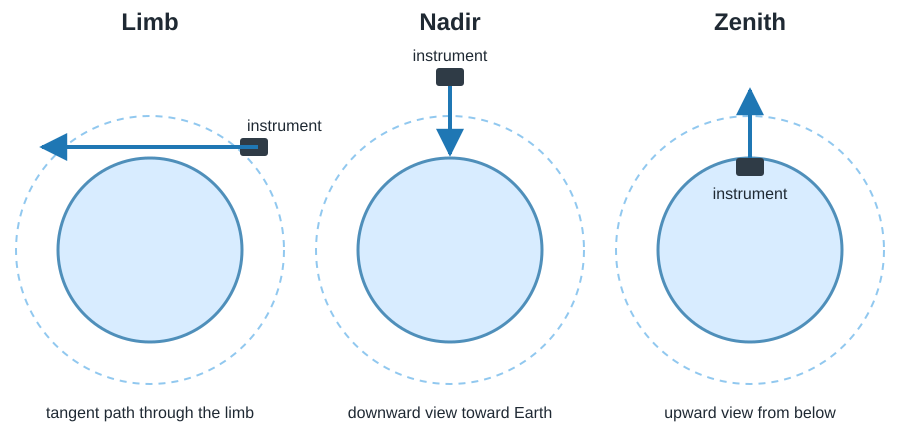

# Overview

The Jülich Rapid Spectral Simulation Code (JURASSIC) is an open-source
infrared radiative transfer model for atmospheric remote
sensing applications. It provides a flexible and computationally
efficient framework for simulating infrared radiances and
transmittances, as well as for performing inverse modelling through an
integrated optimal estimation retrieval system.

JURASSIC is intended for scientific and operational use cases that
require a balance between physical realism and computational
performance, such as large-scale satellite data analysis, sensitivity
studies, and retrieval algorithm development.

---

## Purpose and scope

Infrared remote sensing instruments provide key observations of
atmospheric temperature, trace gases, aerosols, and clouds. While
line-by-line radiative transfer models offer high spectral accuracy,
their computational cost limits their applicability for large datasets,
ensemble simulations, or near-real-time applications.

JURASSIC addresses this challenge by combining established spectral
approximations with precomputed spectroscopic information. This allows
the model to achieve high computational efficiency while maintaining
the level of accuracy required for quantitative atmospheric remote
sensing.

The model is not tied to a specific instrument or mission and is
designed as a general-purpose tool that supports a wide range of
infrared remote sensing geometries and configurations.

---

## Radiative transfer capabilities

JURASSIC represents the atmosphere as a vertically stratified medium
and performs radiative transfer calculations along curved ray paths
that account for atmospheric refraction. The model supports multiple
observation geometries, including limb sounding, nadir and zenith
viewing, and occultation geometry.

*Basic limb, nadir, and zenith viewing geometries used in atmospheric
remote sensing. Arrows indicate the viewing direction; thermal radiance
propagates in the opposite direction toward the instrument.*

Radiative transfer calculations are based on fast spectral
approximations, most notably the Emissivity Growth Approximation (EGA)
and the Curtis–Godson Approximation (CGA). These methods enable accurate
modelling of infrared absorption and emission without the need for
computationally expensive line-by-line calculations during runtime.

Spectral absorption and emission are represented using precomputed
lookup tables derived from detailed line-by-line radiative transfer
models. During execution, band-averaged emissivities and
transmittances are obtained through fast interpolation within these
tables, preserving spectroscopic fidelity while enabling rapid
simulations.

---

## Retrieval and inverse modelling

In addition to forward modelling, JURASSIC includes an integrated
optimal estimation retrieval framework. This allows atmospheric state
variables to be retrieved directly from measured radiances using a
consistent forward–inverse modelling approach.

Typical retrieval targets include atmospheric temperature and trace
gas volume mixing ratios, but the framework is designed to be flexible
and extensible. Retrieval calculations follow established optimal
estimation principles and provide access to diagnostic quantities such
as averaging kernels and error estimates.

---

## Typical applications

JURASSIC has been applied in a wide range of atmospheric remote sensing
studies, particularly for infrared limb and nadir measurements from
satellite instruments. Applications include:

- trace gas retrievals and climatologies  
- temperature retrievals for gravity wave studies  
- aerosol and cloud analyses  
- sensitivity studies and forward-model benchmarking  

The model has been used extensively in the analysis of measurements
from instruments such as the Michelson Interferometer for Passive
Atmospheric Sounding (MIPAS) and the Atmospheric Infrared Sounder
(AIRS), among others.

A selection of scientific publications using JURASSIC is provided in
the [References](references.md) section.

---

## Model assumptions and extensions

The core JURASSIC model assumes local thermodynamic equilibrium (LTE),
such that molecular level populations are determined by the local
atmospheric temperature. This assumption is valid for most infrared
remote sensing applications in the troposphere and stratosphere.

The standard configuration of JURASSIC is designed for clear-air
conditions, where scattering of infrared radiation can be neglected.
Simplified parameterizations can be used to represent cloud and aerosol
effects in many applications. More advanced treatments of infrared
scattering have been developed in dedicated extensions and applied in
specialized studies.

Over time, the broader JURASSIC ecosystem has also included additional
developments such as tomographic retrieval methods and GPU-accelerated
radiative transfer. In this repository, GPU-related functionality is
exposed only through optional integration hooks to external unified
builds rather than as a self-contained default capability.

---

## Software design and performance

JURASSIC is implemented in the C programming language with a modular
architecture that separates ray tracing, radiative transfer,
spectroscopy, and retrieval components. The model supports
workflow-level parallelism, MPI-based task distribution for retrieval
workflows, and OpenMP-enabled code paths in selected kernels, and is
designed for efficient execution on multicore CPUs and high-performance
computing systems.

Automated tests and example projects are provided to verify correct
installation and numerical behaviour. Model outputs have been
extensively validated against reference radiative transfer models and
documented in intercomparison studies.

JURASSIC is distributed as open-source software under the GNU General
Public License (GPL) and is openly available to support transparent,
reproducible, and extensible atmospheric remote sensing research.

---

## Related pages

- [Physical background](theory.md)
- [Retrieval theory](retrieval_theory.md)
- [Model assumptions & limitations](limitations.md)
- [Quickstart](quickstart.md)
