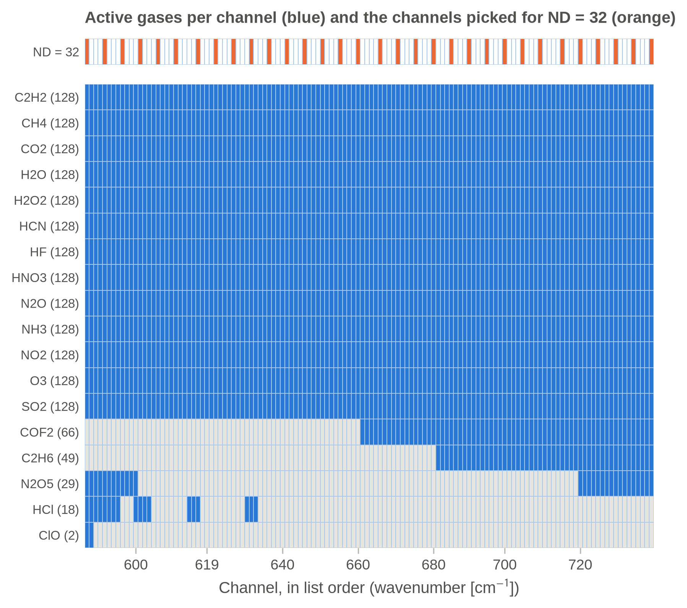
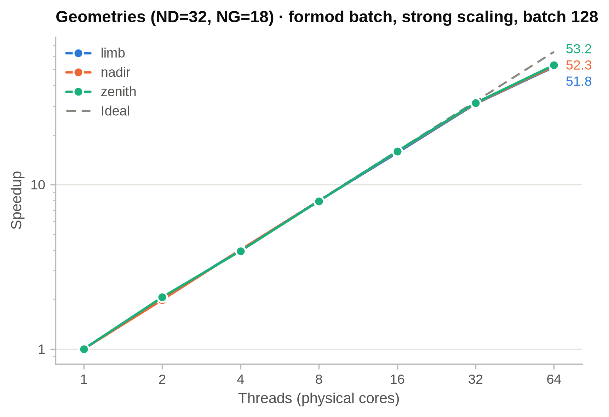
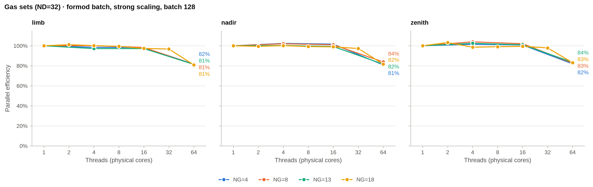
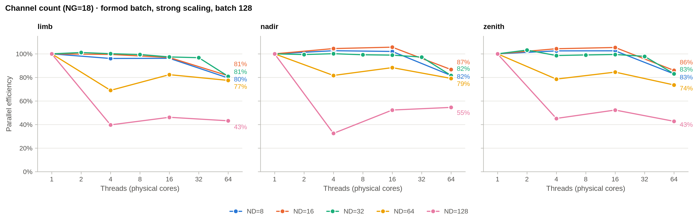
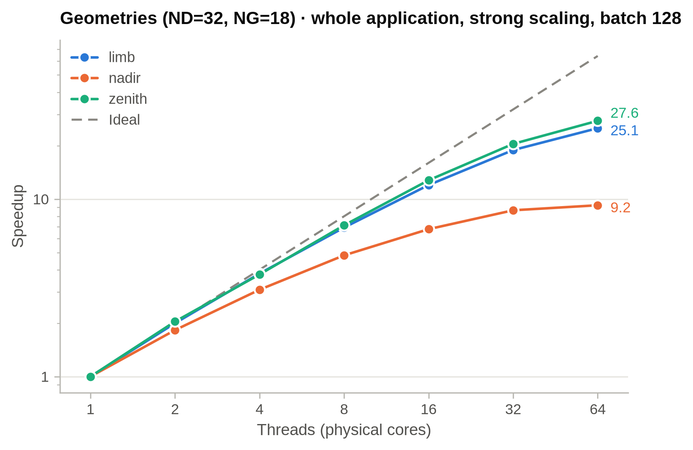

# CPU/OpenMP Benchmark

This directory contains the OpenMP scaling experiment for JURASSIC's forward model (`formod`).

## Scaling over geometry, channels and gas sets (`scaling_axes.sh`)

The experiment varies one axis at a time: geometry (limb, nadir, zenith) number of channels (ND) and gas set (NG). The other two axes stay at a reference setting of 32 channels and all 18 gases (`ng18`), defined per geometry in `configs/baseline_cases.tsv`. This setting lies in the middle of the channel range (8–128) and uses the full gas list.

The reference setting is timed on 1, 2, 4, 8, 16, 32 and 64 threads (one socket) and is the only setting used for the batch-size sweep. All other settings are timed on 1, 4, 16 and 64 threads only. 

Each setting is built with its own ND/NG and timed with `formod TASK time`. The timed part is one call of `formod_batch`, which computes a batch of 128 independent scenes in parallel (one scene per thread at a time). With T1 the time for the batch on 1 thread and Tn on n threads, the speedup is T1 / Tn and the parallel efficiency is T1 / (n × Tn).

T1 is not measured directly: a 1-thread run of all 128 scenes would take about 23 minutes for zenith. Since the scences are independent of eachother, each setting is run on 1 thread with a batch of 4 scenes, and T1 is 32 × that time. A direct 1-thread run of all 128 scenes (mode `t1check`) agreed with this estimate within 0.2 % in an earlier test.

### Channels and gases

JURASSIC only computes a gas in a channel if a lookup table exists for that gas at the channel's wavenumber. The runtime therefore depends on the number of active (channel, gas) pairs, i.e. the pairs for which a lookup table exists, and not simply on ND × NG. The file `configs/channels_alt3.tsv` contains a list of 128 channels between 587 and 739 cm⁻¹, each listed with the gases for which a lookup table exists. 



The script picks ND channels evenly spaced in the list, including the first and the last one (for ND = 32 every 4th or 5th channel), so they cover the whole range from 587 to 739 cm⁻¹. Each column in the figure is one channel of the list. The reference setting has 458 active channel-gas pairs.

The gas sets are defined in `configs/gas_sets/`. The name gives the number of gases, and each set contains the previous one plus some more gases:

| set | gases |
|---|---|
| `ng04` | CO2, H2O, O3, HNO3 |
| `ng08` | `ng04` + CH4, N2O, NH3, SO2 |
| `ng13` | `ng08` + C2H2, H2O2, HCN, HF, NO2 |
| `ng18` | `ng13` + C2H6, COF2, N2O5, HCl, ClO |

`ng13` contains exactly the 13 gases that are active in all 128 channels, so up to `ng13` the number of active pairs is NG × ND. `ng18` adds the 5 gases that are only active in parts of the range (+42 pairs at ND = 32) and is the full gas list.

### Execution

* `strong` (default): fixed batch size, 1 thread up to one socket.
* `t1check`: 1 thread on the full batch, to check the extrapolated T1.
* `batches` (default): one socket's threads over several batch sizes.
* `weak`: fixed scenes per thread.

```sh
cd projects/benchmark
sbatch run_scaling_axes_jureca.sh          # or run_scaling_axes_juwels.sh
python3 eval_scaling_axes.py runs/scaling_axes_<array job id>
```

The evaluation reports runtime, speedup and efficiency for the timed `formod_batch` call and for the whole application (adding table read, reference run and output), plus single-thread cost and efficiency vs batch size.

## Results (JURECA-DC, AMD EPYC 7742, one socket with 64 cores)

Batch of 128 scenes, threads pinned to socket 0. Results are in `jureca_scaling_axes_res/`.



All three geometries scale almost ideally up to 32 threads and reach a speedup of 52–53 on 64 threads (81–83 % efficiency).



The number of gases (NG) has no visible effect on the scaling. 



Up to 32 channels the efficiency does not depend on ND. With 64 and 128 channels it starts to decrease at 4 threads (128 channels: 43–55 % on 64 threads). This is most likely a memory limit, since the lookup tables grow from 29 MB (ND = 32) to 118 MB (ND = 128).



Including the table read, reference run and output, the speedup on 64 threads decreases to 28 (zenith), 25 (limb) and 9 (nadir). The time per phase for the reference setting (batch of 128 scenes) shows why:

| geometry | threads | table read | reference run | other I/O | formod batch | total |
|---|---:|---:|---:|---:|---:|---:|
| limb | 1 | 28.8 s | 6.1 s | 0.1 s | 796 s | 831 s |
| limb | 64 | 11.4 s | 6.2 s | 0.2 s | 15.4 s | 33 s |
| nadir | 1 | 21.0 s | 0.9 s | 0.1 s | 121 s | 143 s |
| nadir | 64 | 12.1 s | 1.0 s | 0.2 s | 2.3 s | 16 s |
| zenith | 1 | 33.0 s | 10.6 s | 0.1 s | 1366 s | 1409 s |
| zenith | 64 | 14.1 s | 10.7 s | 0.2 s | 25.7 s | 51 s |

Table read is `TIMER_READ_TBL`, reference run is `TIMER_FORMOD_REFERENCE` (one scene, computed on a single thread), other I/O is the remaining `TIMER_READ_*` plus `TIMER_WRITE_OBS` and `TIMER_FINALIZE`. The formod batch is the mean time of one batch from the `RUNTIME` line; on 1 thread it is the extrapolated T1 (see above).
