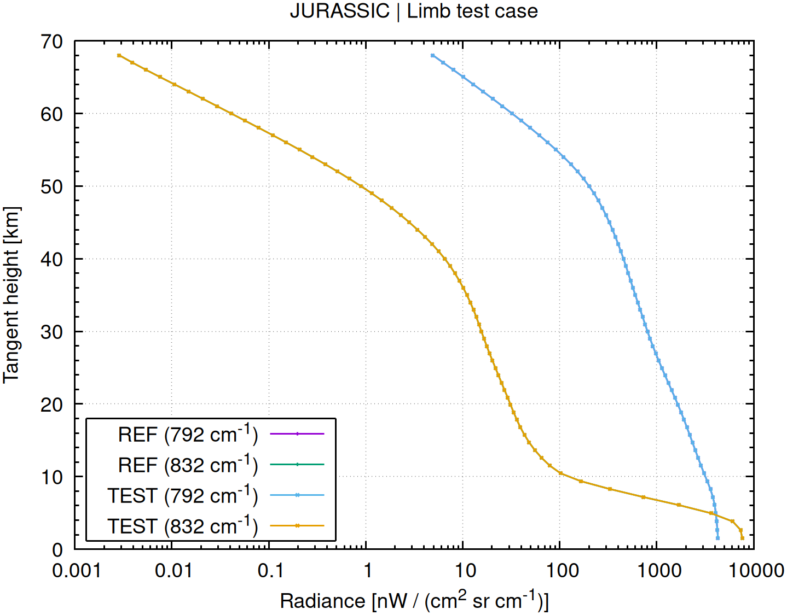
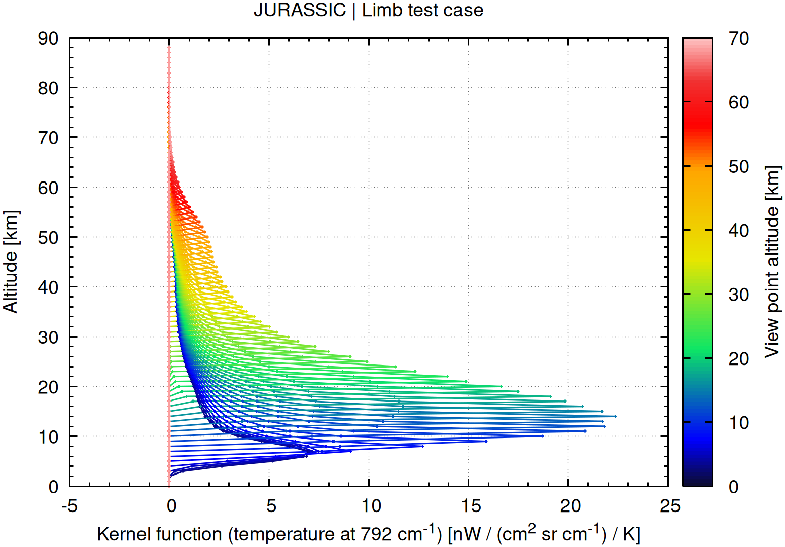
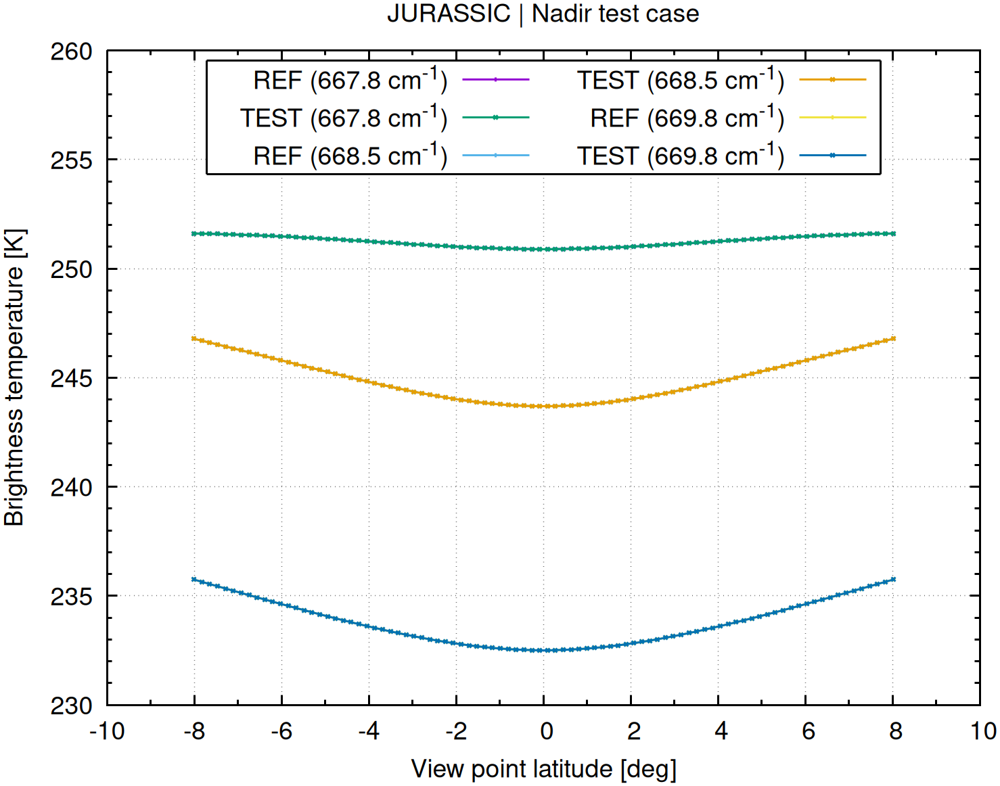
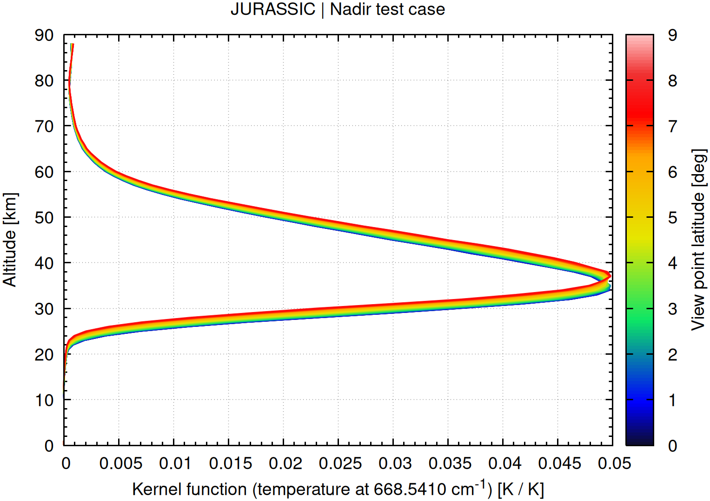
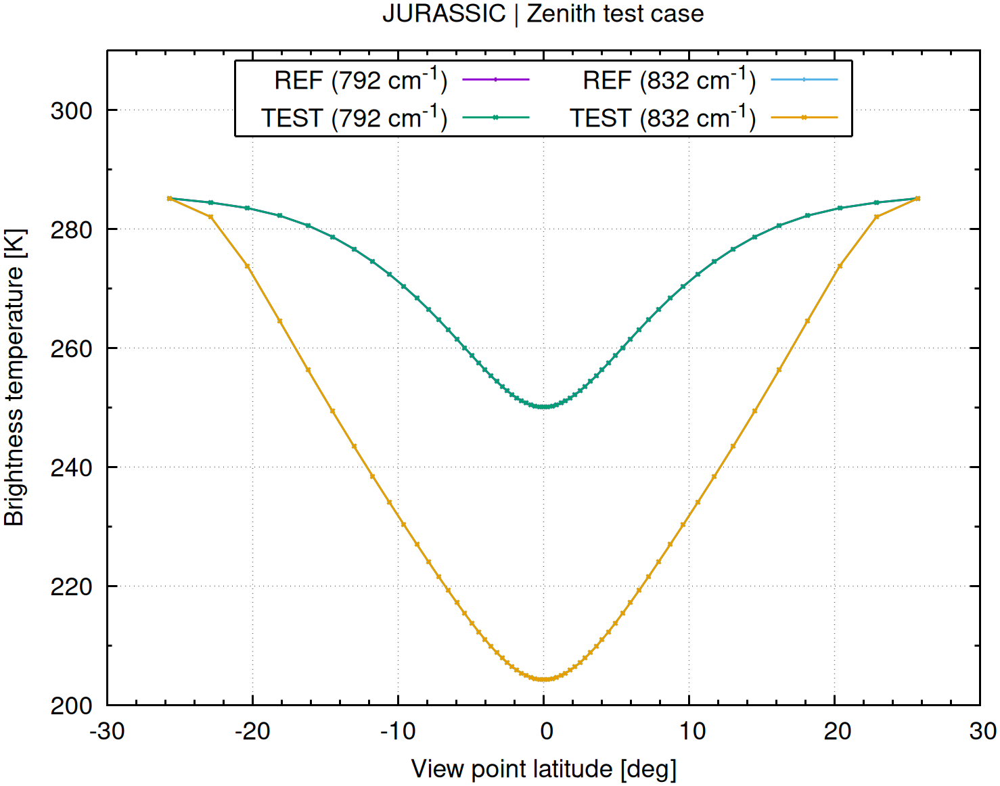
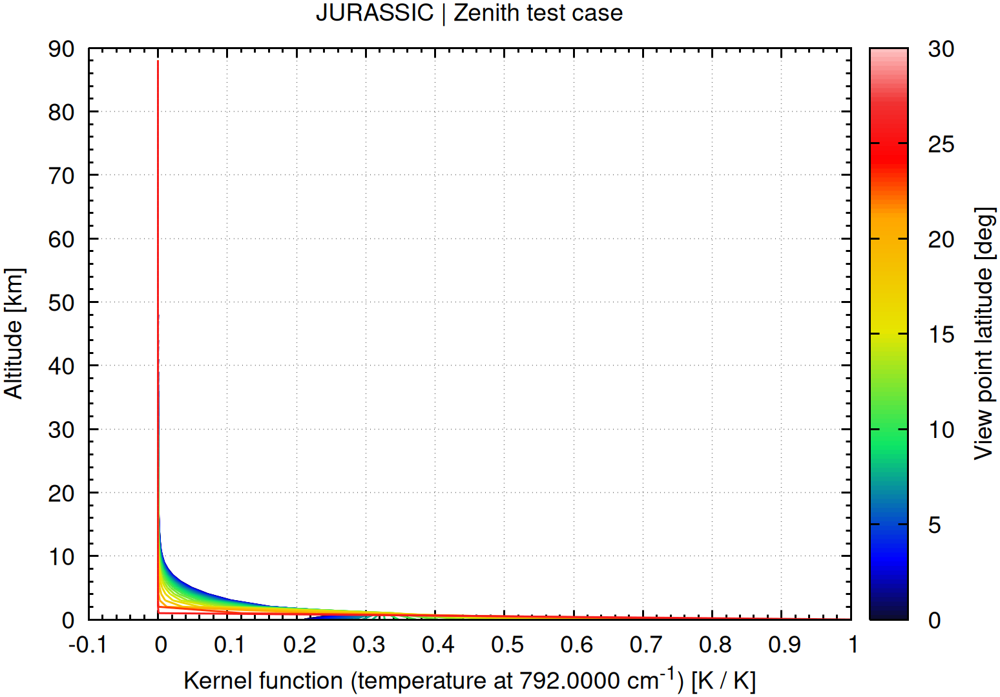

# JURASSIC examples

These examples provide small, self-contained introductions showing how to run
radiative transfer calculations with JURASSIC for three common observation
geometries:

- `limb/` simulates atmospheric limb sounding along tangent paths.
- `nadir/` simulates downward-looking observations from above the atmosphere.
- `zenith/` simulates upward-looking observations from the surface.

JURASSIC simulates thermal infrared radiative transfer through the atmosphere.
Along a line of sight, atmospheric layers both emit thermal radiation and
absorb radiation emitted elsewhere along the path. The resulting radiance
depends on atmospheric temperature, absorber concentrations, spectral channel,
and optical path length, while the observation geometry determines which layers
contribute most strongly to the signal and its sensitivity to atmospheric
parameters.

## Scope

The examples use the small set of lookup tables under `tests/data/` and are
intended for installation checks, tutorials, and configuration experiments.
Numerical validation across broader spectral and gas configurations is provided
separately under `projects/validation/`; performance measurements are under
`projects/benchmark/`.

## Installation

Build JURASSIC and its bundled libraries from the repository root before running
an example:

```bash
cd libs
bash build.sh
cd ../src
make -j
cd ..
```

Then run an example from its own directory:

```bash
cd projects/examples/nadir
./run.sh
```

## Using precompiled binaries

The examples normally use the locally built executables in `src/`. To use an
extracted precompiled development package instead, set `JURASSIC_BIN` to its
`bin` directory:

```bash
git clone https://github.com/slcs-jsc/jurassic.git
cd jurassic

export JURASSIC_BIN=/path/to/jurassic-linux-x86_64-<commit>/bin

cd projects/examples/nadir
./run.sh
```

The repository is still needed for the example configurations, lookup tables,
scripts, and reference data, but JURASSIC itself does not need to be compiled
when `JURASSIC_BIN` points to the packaged executables. Without `JURASSIC_BIN`,
the scripts use the normal source build in `src/`. Gnuplot is still required for
the diagnostic plots.

Each script generates an atmosphere (`atm.tab`), observation geometry
(`obs.tab`), radiative-transfer result (`rad.tab`), kernel functions
(`kernel.tab`), and diagnostic PNG plots. It finishes by comparing `rad.tab`
exactly with the checked-in `rad.org` reference and returns a nonzero status if
they differ.

## Limb example

The limb case views long slant paths through atmospheric tangent points at
different altitudes. Because each ray spends a long distance near its lowest
altitude, the geometry provides strong vertical sensitivity to temperature and
trace gases near the tangent region.

```bash
cd projects/examples/limb
./run.sh
```



*Simulated limb radiances at 792 and 832 cm<sup>-1</sup> as a function of
tangent altitude.*

The radiance profiles show the simulated signal at 792 and 832 cm<sup>-1</sup>
as a function of tangent height. Their channel-dependent shapes are physically
plausible: temperature, absorber amount, Planck emission, and the optical depth
of the long slant path all change with tangent altitude, so the radiance need
not vary monotonically.



*Temperature kernel profiles for the limb geometry at 792 cm<sup>-1</sup>.*

The temperature kernel is the sensitivity of simulated radiance to a local
temperature perturbation. Each coloured profile belongs to a different tangent
height. The long path segment near the tangent point localizes the sensitivity
near and above that region; the ray does not sample lower altitudes, and optical
depth limits contributions from more distant layers. The kernel is therefore a
sensitivity diagnostic, not an independent validation result.

## Nadir example

The nadir case looks down from a satellite across a latitude scan. It
demonstrates how thermal emission emerging from the atmosphere is represented
as brightness temperature in three nearby channels.

```bash
cd projects/examples/nadir
./run.sh
```



*Simulated nadir brightness temperatures in three nearby spectral channels
across the latitude scan.*

Brightness temperature is the temperature a blackbody would need to reproduce
the simulated channel radiance. The CO<sub>2</sub> channels at 667.7820,
668.5410, and 669.8110 cm<sup>-1</sup> have different absorption
strengths and therefore sample different effective emitting levels and temperature ranges. This
explains the physically plausible separation of their brightness temperatures.



*Temperature kernel profiles for the nadir scan at 668.5410 cm<sup>-1</sup>.*

This kernel is the sensitivity of simulated brightness temperature to local
temperature perturbations. Its vertical structure shows the thermal-emission
weighting: peaks mark the atmospheric levels that contribute most strongly in
the channel at each scan position. It is a sensitivity diagnostic, not an
independent validation result.

## Zenith example

The zenith case observes upward from the surface through the atmosphere at a
range of viewing angles. It illustrates downwelling atmospheric emission and
the transition from a short vertical path to longer slant paths.

```bash
cd projects/examples/zenith
./run.sh
```



*Simulated zenith-viewing brightness temperatures at 792 and 832 cm<sup>-1</sup>
across the angular scan.*

The brightness-temperature curves are approximately symmetric around the
vertical view because opposite viewing directions traverse equivalent model
atmospheres. Toward more oblique angles, the atmospheric path length and optical
depth increase, enhancing the contribution of the lower atmosphere; the
resulting brightness-temperature changes and decreasing transmittance are
physically expected.



*Temperature kernel profiles for the zenith geometry at 792 cm<sup>-1</sup>.*

The temperature kernel is the sensitivity of simulated brightness temperature
to a local temperature perturbation. Its vertical structure describes the
weighting of downwelling thermal emission: compared with the shorter vertical
path, more oblique rays generally give greater weight to the lower, denser
atmosphere. The kernel is a sensitivity diagnostic, not an independent
validation result.

The scripts overwrite their generated TAB and PNG outputs in place. Run
`make check` from `src/` for the regression suite.
