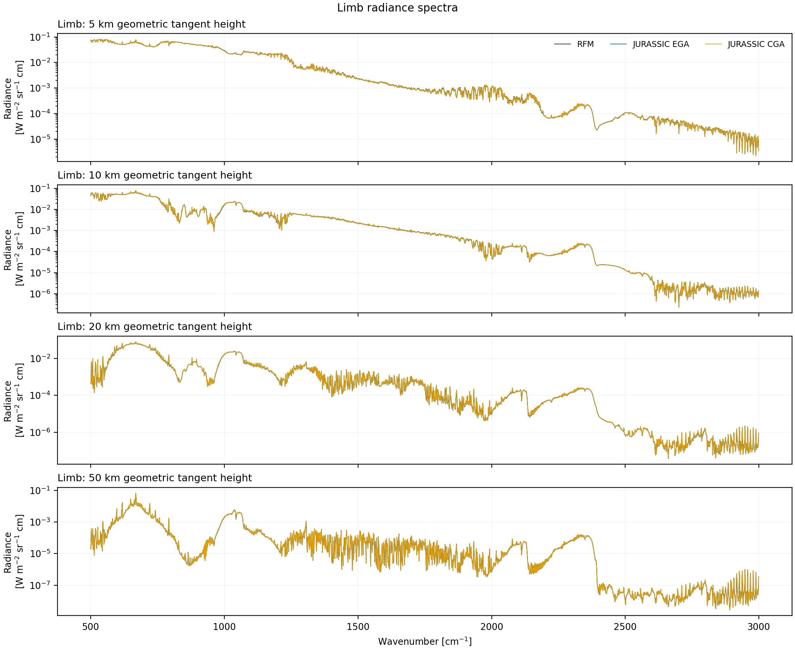
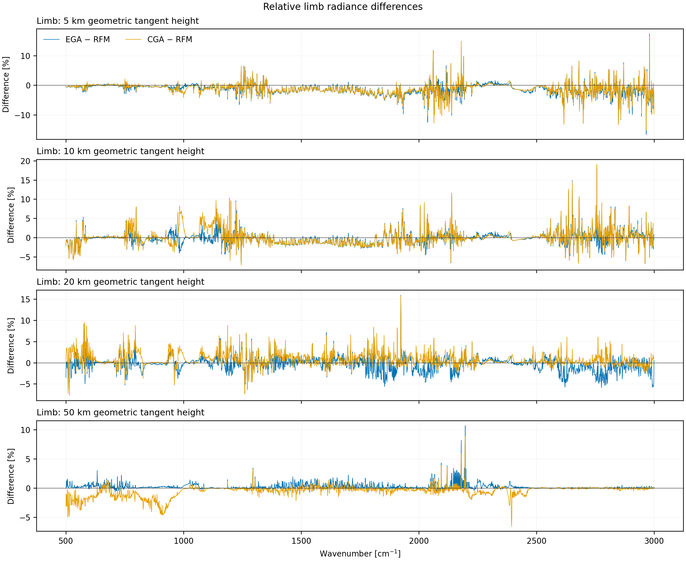
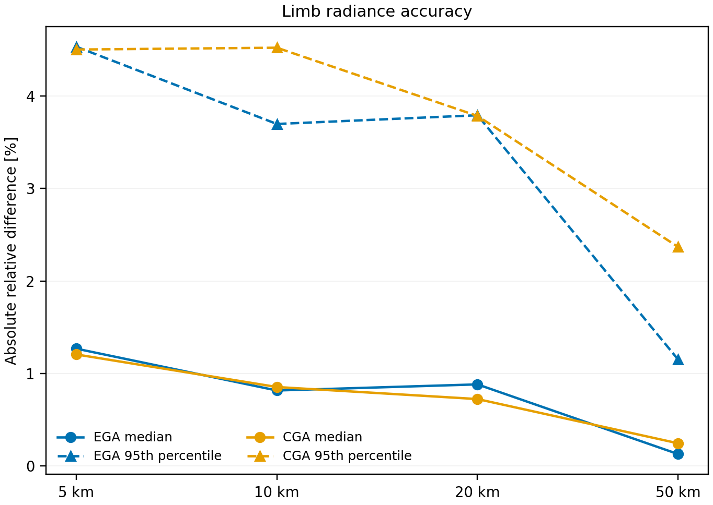
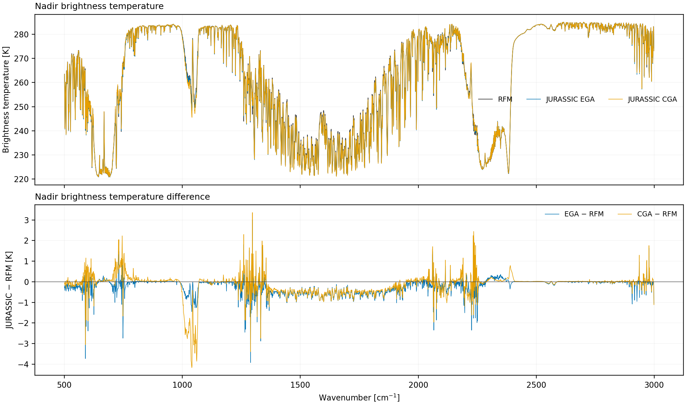
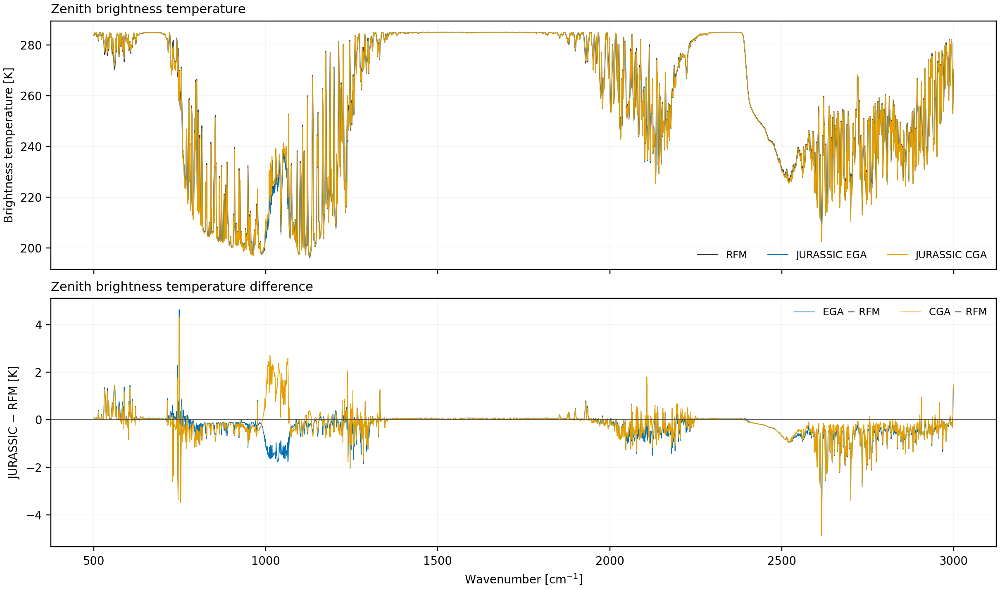
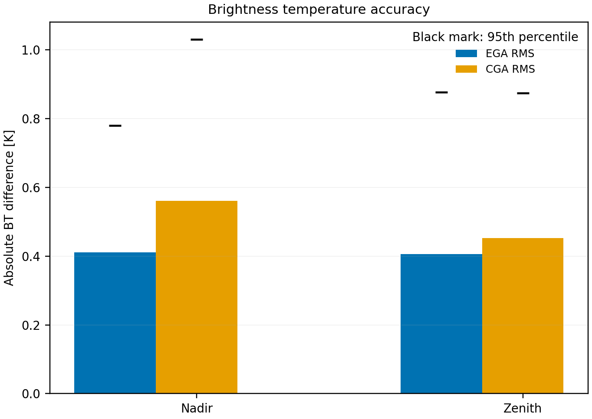
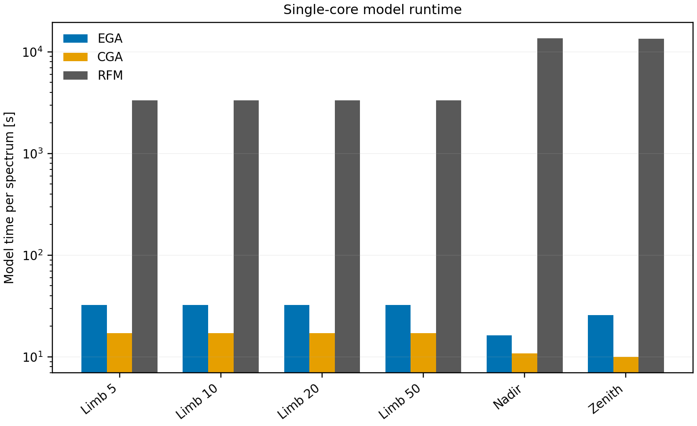

# JURASSIC–RFM validation report

This report is generated by `../analyze.py` from the compact spectra and timing
files in this validation project. No values below are entered manually.

## Configuration

- JURASSIC commit: `98ea98c949a283fa5ffa7c7eb4961af7e538ed89`
- Spectral grid: 500–2999 cm⁻¹ at 1 cm⁻¹ sampling
- Atmospheric composition: mid-latitude climatology with 36 gases
- Geometries: limb at 5, 10, 20, and 50 km geometric tangent height; one nadir and one zenith ray
- Refraction: enabled consistently for JURASSIC and RFM
- JURASSIC modes: EGA and CGA
- Threads per model process: 1
- Channels compared per spectrum: 2500
- Spectral execution: 20 chunks of at most 128 channels; one contiguous RFM block per chunk

RFM spectra are averaged with the same channel response functions used by
JURASSIC. Limb errors are relative radiance errors. Nadir and zenith errors
are absolute brightness temperature errors. All limb channels are included;
only an exactly zero RFM radiance would have an undefined relative error.

## Limb spectra and errors

### Limb error statistics

| Height | Method | RMS [%] | Median [%] | 95th percentile [%] | Maximum [%] |
|---:|:---|---:|---:|---:|---:|
| 5 km geometric | EGA | 2.390 | 1.269 | 4.534 | 17.391 |
| 10 km geometric | EGA | 1.856 | 0.816 | 3.699 | 17.908 |
| 20 km geometric | EGA | 1.782 | 0.882 | 3.793 | 16.000 |
| 50 km geometric | EGA | 0.608 | 0.128 | 1.151 | 10.704 |
| 5 km geometric | CGA | 2.322 | 1.206 | 4.504 | 16.814 |
| 10 km geometric | CGA | 2.086 | 0.854 | 4.523 | 19.069 |
| 20 km geometric | CGA | 1.775 | 0.723 | 3.786 | 15.901 |
| 50 km geometric | CGA | 1.055 | 0.245 | 2.368 | 8.883 |

## Nadir and zenith brightness temperature

### Brightness temperature error statistics

| Geometry | Method | RMS [K] | Median [K] | 95th percentile [K] | Maximum [K] |
|:---|:---|---:|---:|---:|---:|
| Nadir | EGA | 0.464 | 0.142 | 0.879 | 3.926 |
| Zenith | EGA | 0.574 | 0.152 | 1.311 | 4.865 |
| Nadir | CGA | 0.590 | 0.111 | 1.028 | 4.169 |
| Zenith | CGA | 0.589 | 0.166 | 1.275 | 4.873 |

## Runtime

The model times exclude validation input generation, plotting, and final output
writing. JURASSIC time is `TIMER_FORMOD`. RFM time is its measured path plus
spectral phases minus measured output time. For limb, the four-ray calculation
is divided by four. Lookup-table reading and preparation are therefore not part
of the per-spectrum forward-model times shown here.

| Geometry | EGA [s] | CGA [s] | RFM [s] | RFM/EGA | RFM/CGA |
|:---|---:|---:|---:|---:|---:|
| Limb (per ray) | 32.45 | 17.11 | 3352.47 | 103× | 196× |
| Nadir | 16.27 | 10.79 | 13647.73 | 839× | 1265× |
| Zenith | 25.86 | 10.03 | 13412.67 | 519× | 1338× |

These timings describe this recorded run and machine; they are not portable
performance guarantees. Accuracy statistics are computed from the complete
500–2999 cm⁻¹ channel set stored in the repository.
